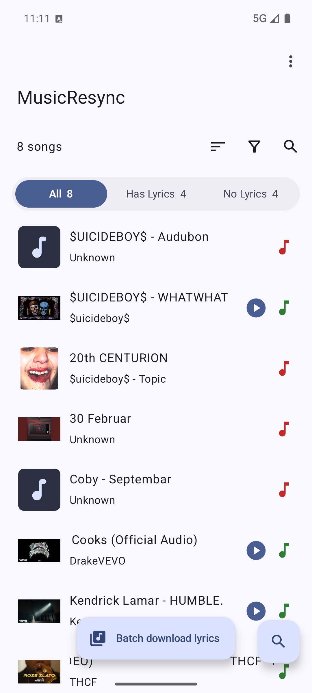
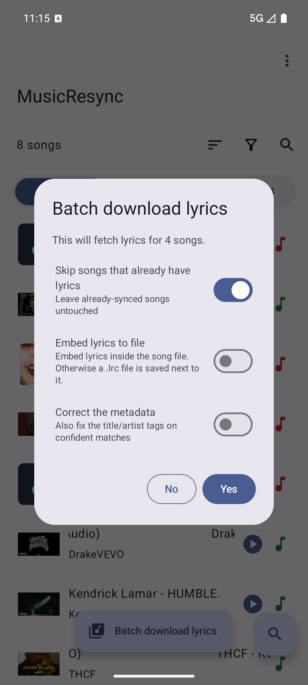
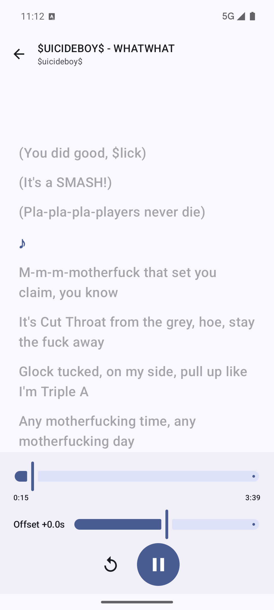

# 🎵 MusicResync

**Smart synced-lyrics fetcher for Android — built for music with bad or missing metadata.**

MusicResync scans a folder of local music (even messy SnapTube/YouTube rips with broken tags) and finds
**time-synced `.lrc` lyrics** for every song, using a confidence-scored multi-strategy matching engine. It's a
heavily reworked fork of the excellent [SongSync](https://github.com/Lambada10/SongSync) with a smarter
matching brain, a cleaner UI, and a built-in Samsung-Music-style lyrics player.

<p align="center">
  
  
  
</p>

---

## ✨ What makes it different

### 🧠 Smart matching for bad metadata
Most lyric apps just send your (often wrong) tags to a provider and accept the first result. MusicResync
doesn't:

- **Multi-strategy candidate ladder** — tries tags, then `Artist - Title` / `Title - Artist` filename parsing,
  primary-artist extraction (`Coby X Teodora` → `Coby`), remix/version loosening, and a title-only fallback.
- **Noise stripping** — removes `(MP3_320K)`, `(Official Video)`, `[HD]`, `ft. …`, track numbers, underscores,
  and other junk before searching.
- **Confidence scoring** (title 40% · artist 30% · **duration 20%** · album 10%) with a **duration tiebreak** —
  the track length from your file is matched against each candidate, so the *right* song wins and a wrong
  "first result" (e.g. a random remix) is rejected.
- **Tiers:** ≥85% auto-accept · 60–84% verify · <60% manual.

On a real corpus of messy SnapTube rips this lifts the auto-match rate from ~50% to **75–80%** — including
non-English tracks — *before* any manual work.

### 📥 `_private.lrc` auto-fix (SnapTube)
SnapTube saves lyrics as `Song(MP3_320K)_private.lrc`, which players like Samsung Music ignore because the name
doesn't match the audio. MusicResync detects these on load and **strips the `_private` suffix automatically** —
no network needed. Songs that already have correct `.lrc` files land straight in **Has Lyrics**.

### 🎤 Built-in synced lyrics player
Tap any song with lyrics to open a **Samsung-Music-style player**: your audio plays while the current lyric
line highlights and auto-scrolls. An **offset slider** lets you fine-tune timing — adjusting it seeks the track
~2.5s back so you immediately hear and see whether the new offset lines up.

### 🗂️ Organised + one-tap
- Tabs: **All / Has Lyrics / No Lyrics** with live counts and green/red note indicators per song.
- A centered **Batch download lyrics** button: one tap fetches lyrics for everything that needs them.
- Pre-batch dialog keeps the two choices that matter up top (**skip songs that already have lyrics**,
  **save `.lrc` next to the song**); everything else (embed into the file, **correct the metadata**,
  auto-try other providers) lives under a single **More options** section.

### 🛡️ Robust providers
Every request uses **exponential backoff + jitter** (1→2→4→…→30s) with retries and a hard timeout, plus
**graceful fallback**: if your selected provider errors or times out (e.g. a Spotify API change), MusicResync
quietly falls through the others instead of throwing an error at you. Providers: **LRCLib** (default, no auth,
returns duration + lyrics in one request), **Netease**, **Apple Music**, **Spotify**, **QQ Music**.
Spotify's rotating security keys are fetched from several independent mirrors and cached locally, so a single
source going down doesn't break it — and none of this blocks app launch.

---

## 📲 Install
Grab the APK from the [latest release](../../releases/latest) and sideload it (enable "install from unknown
sources"). Android 5.0+ (minSdk 21). On first launch, grant **All files access** so the app can read your music
and save `.lrc` files next to it.

> No setup or API keys required — LRCLib (the default) needs no account. The other providers are best-effort
> fallbacks. MusicResync uses its own package id, so it installs alongside (not over) the original SongSync.

---

## 🛠️ Build from source
Requires the Android SDK and JDK 17–21 (Android Studio's bundled JBR works well).

```bash
git clone https://github.com/DynamycSound/MusicResync
cd MusicResync
./gradlew :app:assembleDebug      # APK in app/build/outputs/apk/debug/
./gradlew :app:testDebugUnitTest  # run the matching-engine unit tests
```

The matching engine (`app/.../util/matching/`) is pure Kotlin and unit-tested on the JVM against real filenames
and the live LRCLib API — no emulator required to validate it.

---

## 🙏 Credits
MusicResync is a fork of **[SongSync](https://github.com/Lambada10/SongSync)** by Lambada10 and contributors —
huge thanks for the foundation. Provider integrations are inspired by
[syncedlyrics](https://github.com/moehmeni/syncedlyrics) and
[spotify-lyrics-api](https://github.com/akashrchandran/spotify-lyrics-api).

## 📄 License
Licensed under the **GNU General Public License v3.0**, the same as the original SongSync. See [LICENSE](LICENSE).
